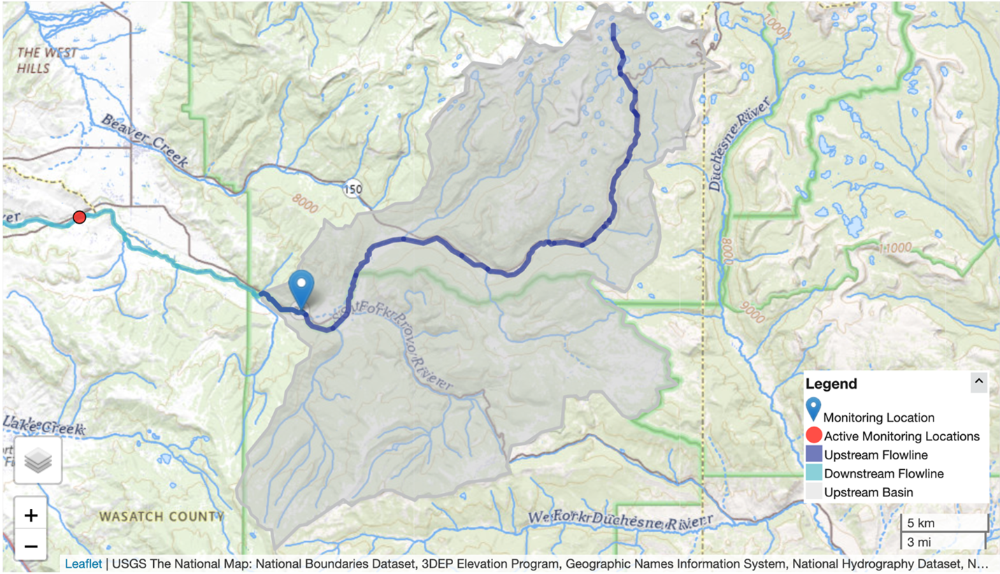

:::::::::::::::::::::::::::::::::::::: questions 

- How should I prepare my run directory?
- What is the Data Preprocess tool?

::::::::::::::::::::::::::::::::::::::::::::::::

::::::::::::::::::::::::::::::::::::: objectives

- Identify the required data structure of a NextGen run
- Explain how the Data Preprocess tool interacts with NGIAB
- Prepare data for an NextGen run

::::::::::::::::::::::::::::::::::::::::::::::::

## NextGen Run Directory Structure (`ngen-run/`)

Running NextGen requires building a standard run directory complete with only the necessary files. Below is an explanation of the standard run directory.

A NextGen run directory `ngen-run` contains the following subfolders:

- `config`:  model configuration files and hydrofabric configuration files. (required)
- `forcings`: catchment-level forcing timeseries files. Forcing files contain variables like wind speed, temperature, precipitation, and solar radiation. (required)
- `lakeout`: for t-route  (optional)
- `metadata` programmatically generated folder used within ngen. Do not edit this folder. (automatically generated)
- `outputs`: This is where ngen will place the output files. (required)
- `restart`: For restart files (optional)

```
ngen-run/
│
├── config/
│
├── forcings/
│
├── lakeout/
|
├── metadata/
│
├── outputs/
│
├── restart/
```
 
#### Configuration directory `ngen-run/config/`
This folder contains the NextGen realization file, which serves as the primary model configuration for the ngen framework. This file specifies which models to run (such as NoahOWP/CFE, LSTM, etc), run parameters like date and time, and hydrofabric specifications (like location, gage, catchment).

Based on the models defined in the realization file, [BMI](https://bmi.csdms.io/en/stable/index.html) configuration files may be required. For those models that require per-catchment configuration files, a folder will hold these files for each model in `ngen-run/config/cat-config`. See the directory structure convention below.

```
ngen-run/
|
├── config/
|   │
|   ├── nextgen_09.gpkg
|   |
|   ├── realization.json
|   |
|   ├── ngen.yaml
|   |
|   ├── cat-config/
|   │   |
|   |   ├──PET/
|   │   |
|   |   ├──CFE/
|   │   |
|   |   ├──NOAH-OWP-M/
```

NextGen requires a single geopackage file. This file is the [hydrofabric (Johnson, 2022)](https://mikejohnson51.github.io/hyAggregate/) (spatial data). An example geopackage can be found on Lynker-Spatial [here](https://www.lynker-spatial.com/data?path=hydrofabric%2Fv2.2%2F). Tools to subset a geopackage into a smaller domain can be found at [Lynker's hfsubset](https://github.com/LynkerIntel/hfsubset). 


## Data Preprocess Tool

**The Data Preprocess tool streamlines data preparation for NextGen simulations.** This tool provides a graphical user interface and a command line interface to prepare input data and run simulations. A graphical user interface facilitates catchment and date range selection options via an interactive map, simplifying the subsetting of hydrofabrics, generation of forcings, and creation of default NextGen realizations. While this module reduces procedural complexity, it incorporates pre-defined assumptions that may limit user flexibility in specific applications [(Cunningham, 2025)](https://github.com/CIROH-UA/NGIAB_data_preprocess).

#### Installing and Using the Data Preprocess Tool

The Data Preprocess tool (like all of our software) is constantly being updated and refined. To install and use the Data Preprocess tool, follow the latest instructions [here](https://github.com/CIROH-UA/NGIAB_data_preprocess). 

|  |
| :--: |
| *Figure 1: Map showing an example drainage basin. View from the USGS National Map.* |

|  |
| :--: |
| *Figure 2: Map showing an example drainage basin. View from the Data Preprocess tool. The highlighted region (light orange area; downstream-most basin in pink) represents the specific study basin, illustrating the river network (blue lines), sub-basins (orange), and surrounding USGS gaging stations (black dots).* |

## Your Turn

Using the Data Preprocess tool, you should be able to create a run directory for your desired catchment that can be used with NGIAB. Try out both the GUI and the CLI, and experiment with different arguments and selection tools!

::::::::::::::::::::::::::::::::::::: keypoints 

- `ngen-run/` is the standard NextGen run directory, containing the realization files that define models, parameters, and run settings; forcing data; outputs; as well as the spatial hydrofabric.
- The Data Preprocess tool simplifies preparing data for NextGen by offering a GUI and CLI for selecting catchments and date ranges, subsetting hydrofabric data, generating forcing files, and creating realization files.

::::::::::::::::::::::::::::::::::::::::::::::::

[r-markdown]: https://rmarkdown.rstudio.com/
