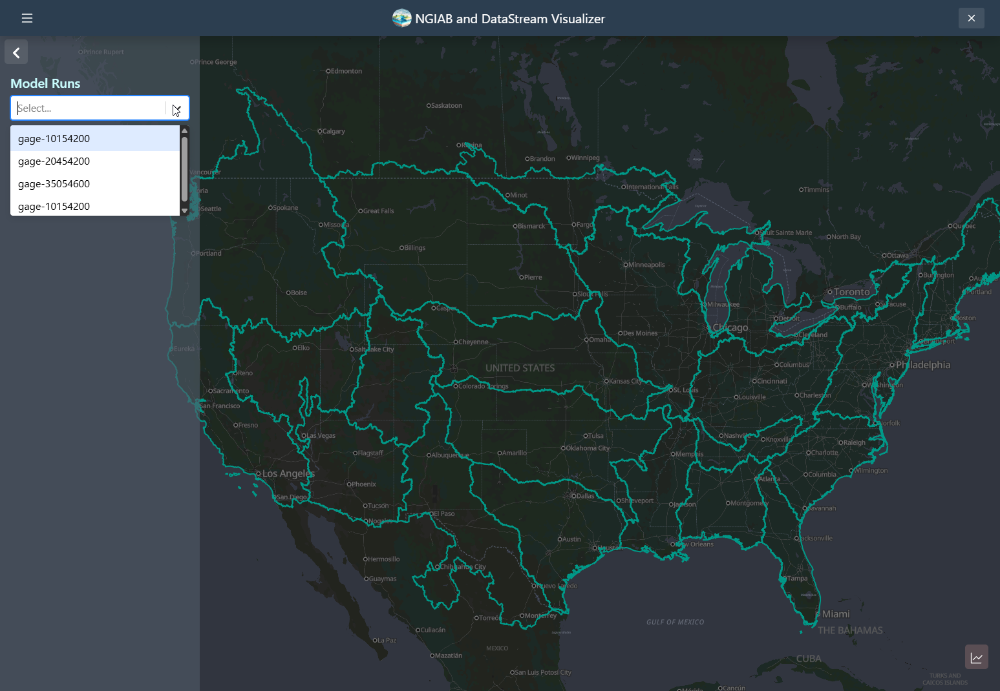
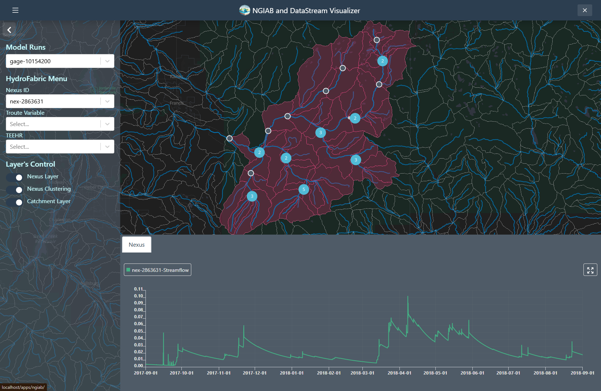
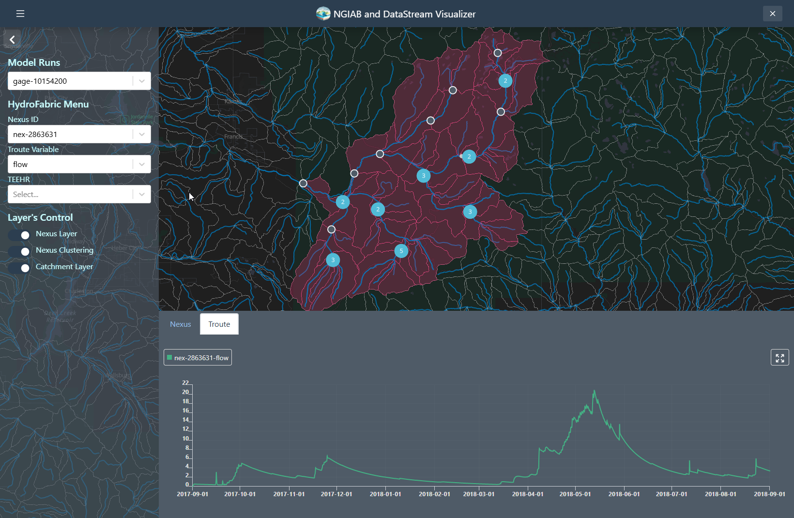
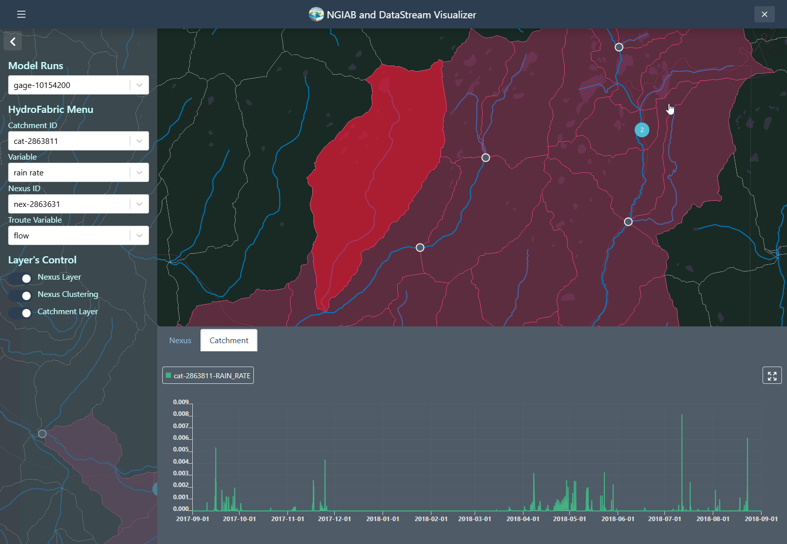
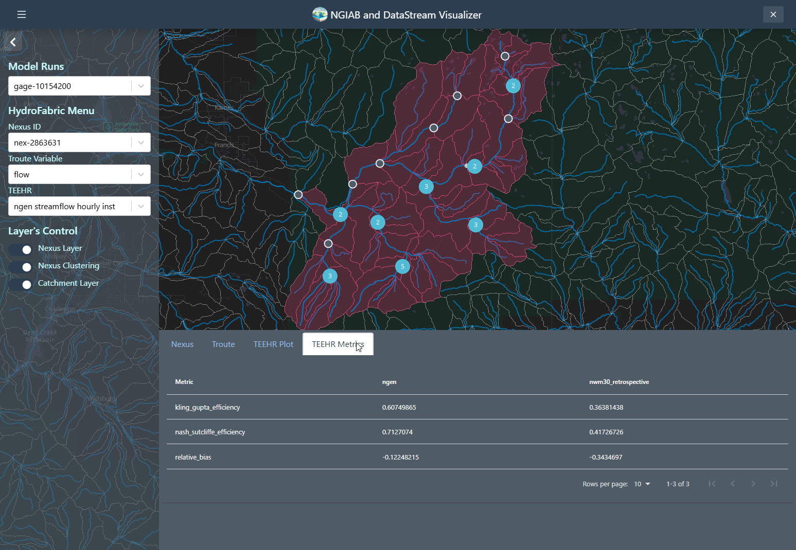

:::::::::::::::::::::::::::::::::::::: questions 

- How do I visualize my NextGen runs?

::::::::::::::::::::::::::::::::::::::::::::::::

::::::::::::::::::::::::::::::::::::: objectives

- Explain how the Data Visualizer complements NGIAB.
- Use the Data Visualizer to visualize results of a NextGen run in NGIAB.

::::::::::::::::::::::::::::::::::::::::::::::::

## Data Visualizer

The Data Visualizer component developed using the Tethys Platform [(Swain et al., 2015)](https://doi.org/10.1016/j.envsoft.2015.01.014) complements NGIAB by providing an environment for **geospatial and time series visualization of catchments and nexus points** (locations where objects in the hydrofabric like streams or water bodies connect). Through a web-based architecture, researchers can explore hydrological data in a spatiotemporal context [(CIROH, 2025)](https://github.com/CIROH-UA/ngiab-client). In addition to standard map-based displays, this component also **supports the visualization of the TEEHR output**, including tabular metrics and interactive time series plots.

{alt='A screenshot of the  NGIAB and DataStream Visualizer web interface. The map displays a the Provo River basin network near Woodland, UT. The gray shaded area represents the basin, dark gray lines represent catchment boundaries, black lines represent major streams, and blue circles with numbers in the middle represent the number of nexus points near that circle.'}

## Using the Data Visualizer with NGIAB

### `ViewOnTethys` Script

Like TEEHR, the Data Visualizer can be activated upon execution of the main NGIAB guide script, `guide.sh`. A separate `viewOnTethys.sh` script is also available in the NGIAB-CloudInfra repository.

Once a run is complete, users can launch the Data Visualizer through their web browser when prompted by the guide script. Although TEEHR’s outputs can be displayed within the Data Visualizer, this tool is primarily designed to provide a broad overview of model results. Users seeking TEEHR’s more advanced analysis features can still access them outside the Data Visualizer.

One of the advantages of the `viewOnTethys.sh` script is that it allows the user to keep multiple outputs for the same hydrofabric. It prompts the user if they want to use the same output directory by renaming it and adding it to the collection of outputs or if they want to overwrite it.

```bash

  ⚠ ~/ngiab_visualizer is not empty.
  → Keep (K) or Fresh start (F)? [K/F]: k
ℹ Reclaiming ownership of ~/ngiab_visualizer  (sudo may prompt)…
  ⚠ Directory exists: ~/ngiab_visualizer/gage-10154200
  → Overwrite (O) or Duplicate (D)? [O/D]: o
  ✓ Overwritten ➜ ~/ngiab_visualizer/gage-10154200
Checking for ~/ngiab_visualizer/ngiab_visualizer.json...

```

You should be able to see multiple outputs through the UI:

{alt='A screenshot of the  NGIAB and DataStream Visualizer web interface. The map displays the ability of the visualizer to use multiple outputs'}

### Visualizer Directory Organization

The Visualizer organizes data using a directory named `ngiab_visualizer`. This directory stores all the outputs generated by the user and includes a file called `ngiab_visualizer.json`. This file contains metadata that allows the Visualizer to locate and manage the outputs from different runs executed via the `./guide.sh` script. The metadata, specific to the Visualizer, is structured as a simple JSON file. It lists the outputs with details such as a label, the data path, and a unique identifier. The `./ViewOnTethys.sh` script handles the creation and management of this metadata.

```json
{
  "model_runs": [
    {
      "label": "gage-10154200",
      "path": "/var/lib/tethys_persist/ngiab_preprocess_output/gage-10154200",
      "date": "2025-05-23:13:51:51",
      "id": "61026834-4235-4d39-8a8e-f076a8854148",
      "subset": "",
      "tags": []
    },
    {
      "label": "gage-20454200",
      "path": "/var/lib/tethys_persist/ngiab_visualizer/gage-20454200",
      "date": "2025-05-23:17:00:34",
      "id": "68f6cf78-188c-4e86-b797-6c40ea36e0e6",
      "subset": "",
      "tags": []
    },
    {
      "label": "gage-35054600",
      "path": "/var/lib/tethys_persist/ngiab_visualizer/gage-35054600",
      "date": "2025-05-23:17:01:10",
      "id": "6d0cb736-2dac-4ea0-a3a3-ad26cd45ef36",
      "subset": "",
      "tags": []
    }
  ]
}

```
The path `/var/lib/tethys_persist/` belongs to the `$HOME` env variable of the container running the visualizer. When the user runs the `./ViewOnTethys.sh`, it mounts the directory from the host at `~/ngiab_visualizer` to `/var/lib/tethys_persist/ngiab_visualizer`. 

However, if the user wants more control, the user can copy their data directory to `~/ngiab_visualizer` on the host(not the container) while the container is **stop**, 

```bash
chown -R $USER: ~/ngiab_visualizer
cp -R your/data/path ~/ngiab_visualizer

```
finally the user can open the `~/ngiab_visualizer/ngiab_visualizer.json` on the host(not the container), and add the specific run to the visualizer: 

```json
....
    {
      "label": "gage-35054600",
      "path": "/var/lib/tethys_persist/ngiab_visualizer<MY_SPECIFIC_OUTPUT_DIRECTORY_NAME>",
      "date": "2025-05-23:17:01:10",
      "id": "6d0cb736-2dac-4ea0-a3a3-ad26cd45ef36",
      "subset": "",
      "tags": []
    }
```
The user can then run `./ViewOnTethys.sh` script to spin again the container or if the user wants more control and just define the env variables and running the container

```bash
export CONFIG_FILE="$HOME/.host_data_path.conf"          \
       TETHYS_CONTAINER_NAME="tethys-ngen-portal"        \
       TETHYS_REPO="awiciroh/tethys-ngiab"               \
       TETHYS_TAG="latest"                               \
       NGINX_PORT=80                                     \
       MODELS_RUNS_DIRECTORY="$HOME/ngiab_visualizer"    \
       DATASTREAM_DIRECTORY="$HOME/.datastream_ngiab"    \
       VISUALIZER_CONF="$MODELS_RUNS_DIRECTORY/ngiab_visualizer.json" \
       TETHYS_PERSIST_PATH="/var/lib/tethys_persist"     \
       SKIP_DB_SETUP=false                               \
       CSRF_TRUSTED_ORIGINS="[\"http://localhost:${NGINX_PORT}\",\"http://127.0.0.1:${NGINX_PORT}\"]"
```

```bash
docker run --rm -d \
  -v "$MODELS_RUNS_DIRECTORY:$TETHYS_PERSIST_PATH/ngiab_visualizer" \
  -v "$DATASTREAM_DIRECTORY:$TETHYS_PERSIST_PATH/.datastream_ngiab" \
  -p "$NGINX_PORT:$NGINX_PORT" \
  --name "$TETHYS_CONTAINER_NAME" \
  -e MEDIA_ROOT="$TETHYS_PERSIST_PATH/media" \
  -e MEDIA_URL="/media/" \
  -e SKIP_DB_SETUP="$SKIP_DB_SETUP" \
  -e DATASTREAM_CONF="$TETHYS_PERSIST_PATH/.datastream_ngiab" \
  -e VISUALIZER_CONF="$TETHYS_PERSIST_PATH/ngiab_visualizer/ngiab_visualizer.json" \
  -e NGINX_PORT="$NGINX_PORT" \
  -e CSRF_TRUSTED_ORIGINS="$CSRF_TRUSTED_ORIGINS" \
  "${TETHYS_REPO}:${TETHYS_TAG}"
```

You should see something like this using `docker ps`

```bash
docker ps

CONTAINER ID   IMAGE                          COMMAND                  CREATED          STATUS                             PORTS                                 NAMES
b1818a03de9b   awiciroh/tethys-ngiab:latest   "/usr/local/bin/_ent…"   25 seconds ago   Up 24 seconds (health: starting)   0.0.0.0:80->80/tcp, [::]:80->80/tcp   tethys-ngen-portal

```

Once it's healthy, you can access the visualizer at:

`http://localhost:${NGINX_PORT}`


The `ViewOnTethys.sh` script automates updating `ngiab_visualizer.json` and copying your model output into `~/ngiab_visualizer`.

::: callout-keypoints
### Key points
- `ViewOnTethys.sh` automates adding model outputs to `ngiab_visualizer.json` and syncing data to `~/ngiab_visualizer`.
- To customize your setup, set environment variables and run the `awiciroh/tethys-ngiab` Docker image manually.
:::


### NGIAB Visualizer UI

The following figures demonstrate several ways the Data Visualizer can be used to visualize model outputs, including geospatial visualization for nexus points, catchment-based visualization, and TEEHR time series representation (hydrographs).

**Nexus** points can be visualized when the user selects the output that wants to visualize. Time series can be retrieved by clicking on any of the **Nexus** points, or by changing the select dropdown assigned to the Nexus. 

{alt='A screenshot of the  NGIAB and DataStream Visualizer web interface. The map displays the ability of the visualizer to retrieve time series from Nexus points'}

**Troute**  variables time series can also be displayed using the **Troute** select dropdown.

{alt='A screenshot of the NGIAB and DataStream Visualizer web interface. The map displays the ability of the visualizer to retrieve time series from Troute variables'}

**Catchments** time series can be retrieved by clicking on any of the **Catchments** polygons, or by changing the select dropdown assigned to the Catchments.

{alt='A screenshot of the  NGIAB and DataStream Visualizer web interface. The map displays the ability of the visualizer to retrieve time series from Catchments variables'}

**TEEHR** evaluation can be visualized when the user hits a point that contains **TEEHR** evaluation output, the user can also look at a **Nexus** point on the dropdown assigned and enter the id of the **Nexus** points that contains **TEEHR** evaluation output.

{alt='A screenshot of the  NGIAB and DataStream Visualizer web interface. The left panel contains a "Time Series Menu" where the user can select a Nexus ID, variable (e.g., flow), and TEEHR data source. A map in the center displays a stream reach with a highlighted section representing the drainage basin and a blue point, indicating the selected nexus location. Below the map, a time series plot compares USGS (blue line) and Ngen (orange line) streamflow data from 2017 to 2023.'}

Similarly, a **TEEHR** evaluation metric can be visualized by going to the metrics tab.

{alt='A screenshot of the  NGIAB and DataStream Visualizer web interface. The map displays the ability of the visualizer to retrieve the TEEHR metrics on a table."Teehr Metrics" presents performance metrics (e.g., Kling-Gupta Efficiency, Nash-Sutcliffe Efficiency, and Relative Bias) for the selected model versus reference data.'}

::::::::::::::::::::::::::::::::::::: callout

### Using Data Visualizer with SSH

To use the Data Visualizer through an Secure Shell (SSH) connection, you will have to set up port forwarding when connecting to the remote machine. Port forwarding will allow you to access a remotely hosted browser session on your local machine. See the instructions under "Using NGIAB through an SSH connection" in the [Advanced Topics episode](/training-NGIAB-101/advanced-topics.html) in this training module. 

::::::::::::::::::::::::::::::::::::::::::::::::

### NGIAB DataStream UI

The Visualizer also allows the user to download data as well from an [S3 bucket](https://datastream.ciroh.org/index.html) containing the output of the [NextGen DataStream](https://github.com/CIROH-UA/ngen-datastream). The `ViewOnTethys.sh` script will create a `~/.datastream_ngiab` directory in which it saves all the different outputs downloaded by the visualizer. It will also create a `~/.datastream_ngiab/datastream_ngiab.json` in which metadata will be saved to locate the downloaded output directories. It serves as a cache, so it allows the user to look first at the `~/.datastream_ngiab` before trying to download the data

```bash
ℹ Reclaiming ownership of /home/aquagio/.datastream_ngiab  (sudo may prompt)…
  ℹ No existing Datastream cache found – a fresh download will be used.
```

The `.datastream_ngiab.json` appends the different downloads with metadata that allows the user to know the file being downloaded. The `prefix` belongs to the path on the s3 bucket. The `label` is created with the following format: `ngen.<date>_<forecast_type>_<cycle>_<VPU>`

```json
{
    "datastream": [
        {
            "label": "ngen.20250522_medium_range_06_VPU_02",
            "bucket": "ciroh-community-ngen-datastream",
            "prefix": "v2.2/ngen.20250522/medium_range/06/VPU_02/ngen-run.tar.gz",
            "path": "/var/lib/tethys_persist/.datastream_ngiab/ngen.20250522_medium_range_06_VPU_02",
            "date": "2021-01-01:00:00:00",
            "id": "15145d327f19426b890e4465160f963a"
        }
    ]
}
```

**Note** assuming only the first ensemble. If we are specific it will look like this: 
`ngen.<date>_<forecast_type>_<cycle>_<ensemble>_<VPU>`

This functionality allows the user to be able to quicklu search the data they want from the [S3 bucket](https://datastream.ciroh.org/index.html) containing the output of the [NextGen DataStream](https://github.com/CIROH-UA/ngen-datastream). They can explore and download as needed.


{alt='A screenshot of the  NGIAB and DataStream Visualizer web interface displaying the hydrofabric for DataStream output'}

## Your Turn

Use the `ViewOnTethys.sh` script to launch the Data Visualizer in Docker, then open `http://localhost:${NGINX_PORT}` in your browser. Explore at least three different visualization modes—such as Nexus time series, catchment hydrographs, and TEEHR performance metrics. Next, edit `~/ngiab_visualizer/ngiab_visualizer.json` to add a new model run (define its label and path), restart the visualizer, and confirm it appears in the dropdown menu.

::::::::::::::::::::::::::::::::::::: keypoints

- The Data Visualizer (built on the Tethys Platform) provides interactive geospatial maps and time series plots for NextGen model outputs in NGIAB.
- It integrates seamlessly with NGIAB via `guide.sh` or `ViewOnTethys.sh`.
- Model outputs reside under `~/ngiab_visualizer`, with metadata stored in `ngiab_visualizer.json`.
- You can visualize Nexus points, catchment summaries, Troute variables, and TEEHR hydrographs and performance metrics.

::::::::::::::::::::::::::::::::::::::::::::::::

[r-markdown]: https://rmarkdown.rstudio.com/
